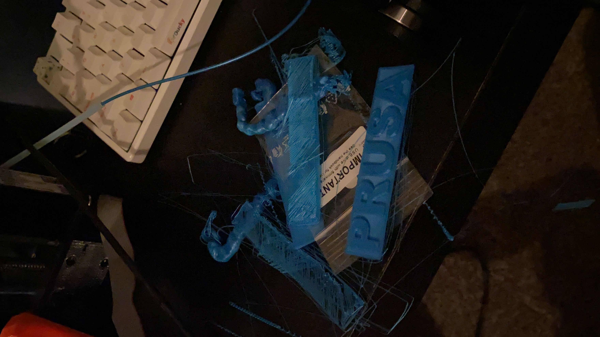
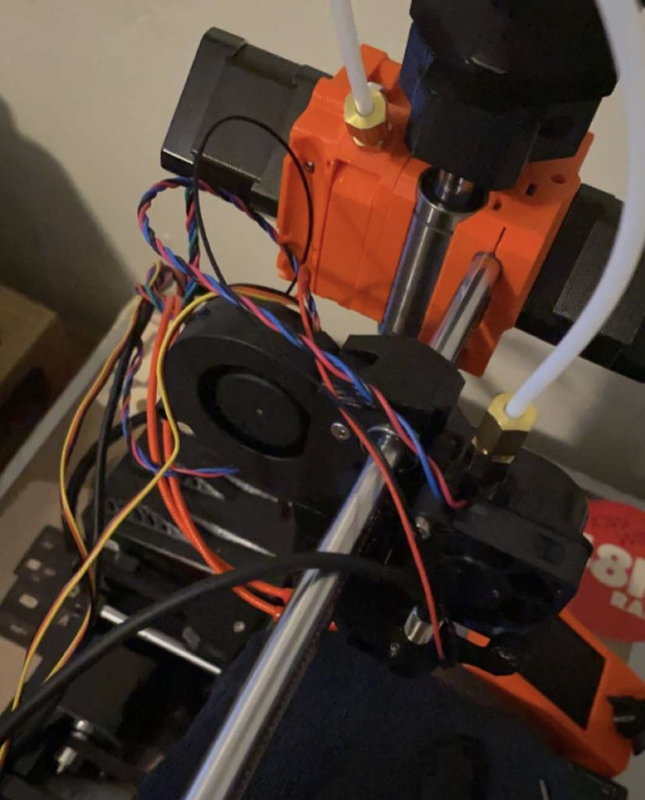

# 3D Printing Dashboard

A simple statistics dashboard plugin for Octoprint.

## Contents
+ Motivation behind the project
+ What I've learned thus far
+ Chosen libraries/technologies
+ Hopes for the future

## Motivation
What was the last article you read or video you watched about 3d printing? Was it about 3d printing sustainable houses? The future of in-home manufacturing of consumer goods? The ability to create robust engineering prototypes? These are some familiar use cases that can make the technology seem like the "next big thing", but for hobbyists and budget constrained users, 3d printing can be an exercise in futulity.

While it may appear that nice prints appear as if by magic, to refine them (or often even complete them successfully at all) takes expertise developed over time through reading user forums, watching hobbyists reassemble their printers on YouTube, and lots and lots of staring at the printer to try to figure out what exactly is going on. Fractions of a millimeter of distance between a printing nozzle and the bed of a printer can make a big difference in print quality. For example, less than a milimeter made the difference between pulling apart:

and forming a bottom layer that resulted in a high quality print.

Having a collection of statistics to view regarding a large volume of prints helps the printing process rely less on intuition and individual embodied knowledge, allowing users to create better prints more quickly. By creating a tool for myself to help monitor useful metrics and make recommendations, I'll ideally not only make more successful prints and improve their overall quality, but waste fewer materials and spend less time and money fixing a broken printer.

(Less of this please!)

## Lessons Learned

## Libraries and Technologies Used

## Future Goals and Aspirations